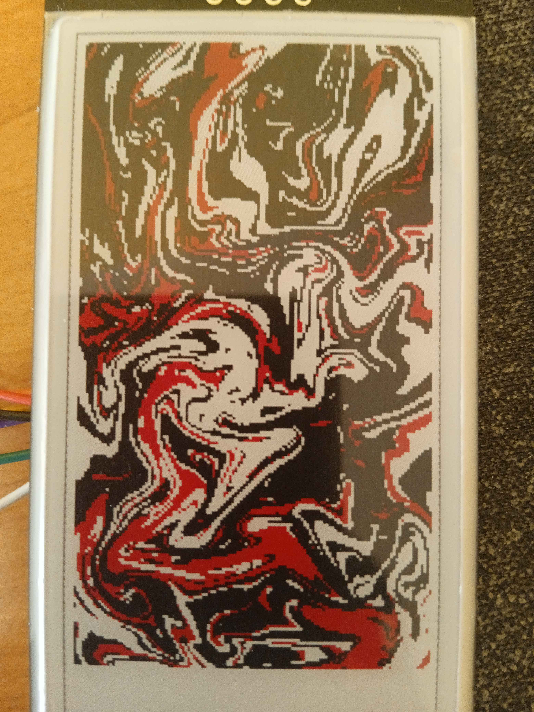
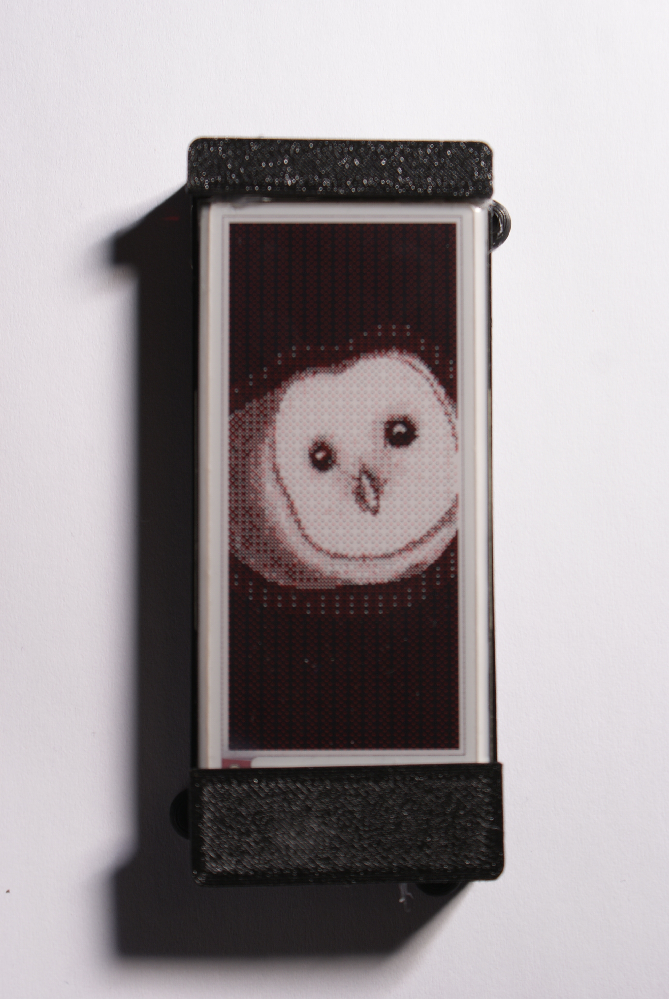
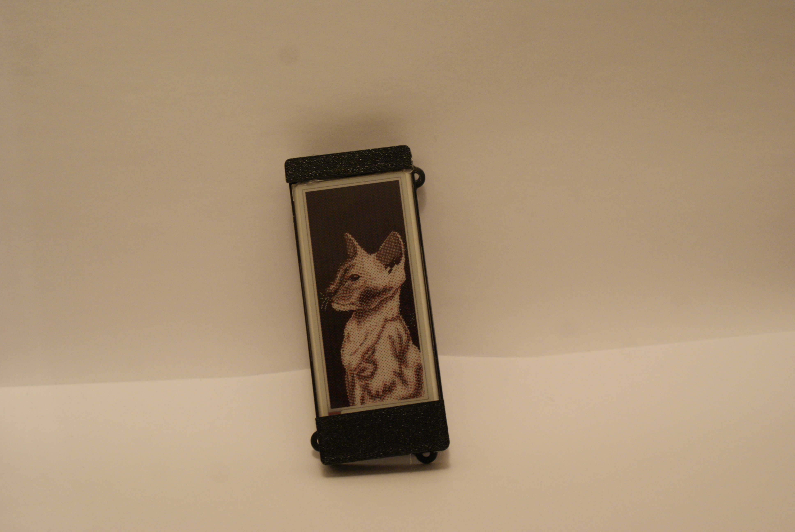
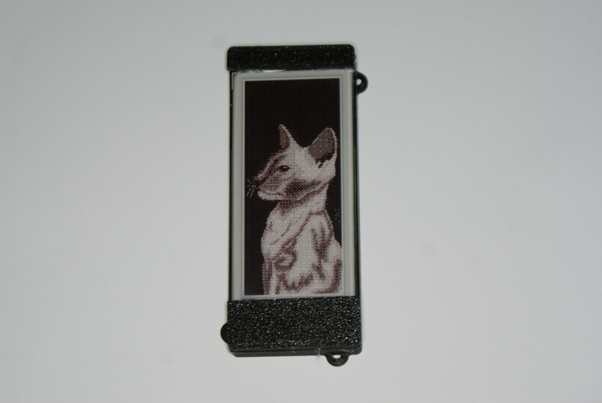
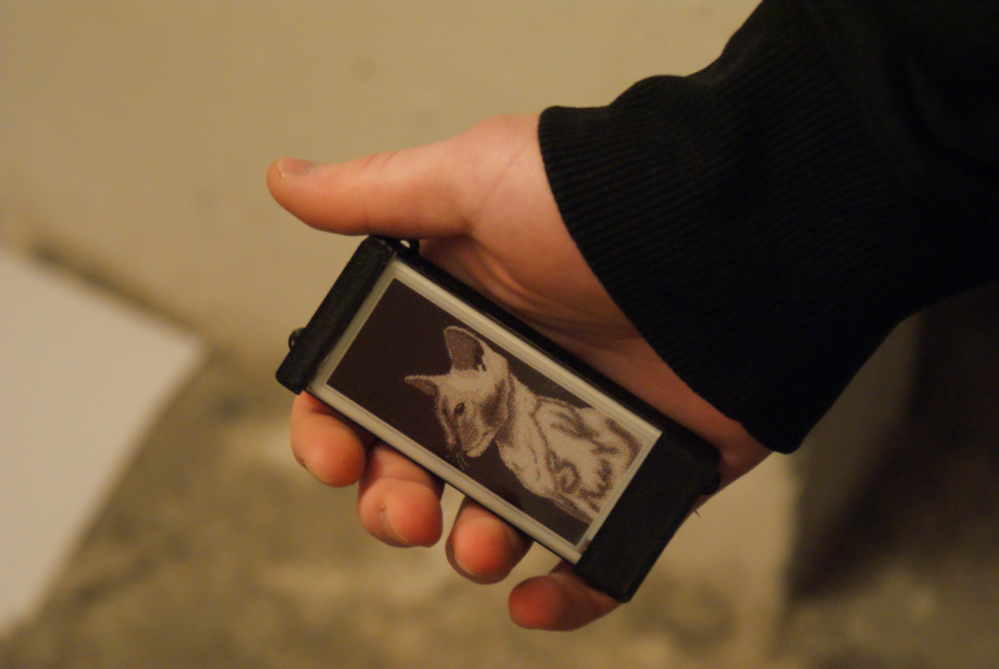
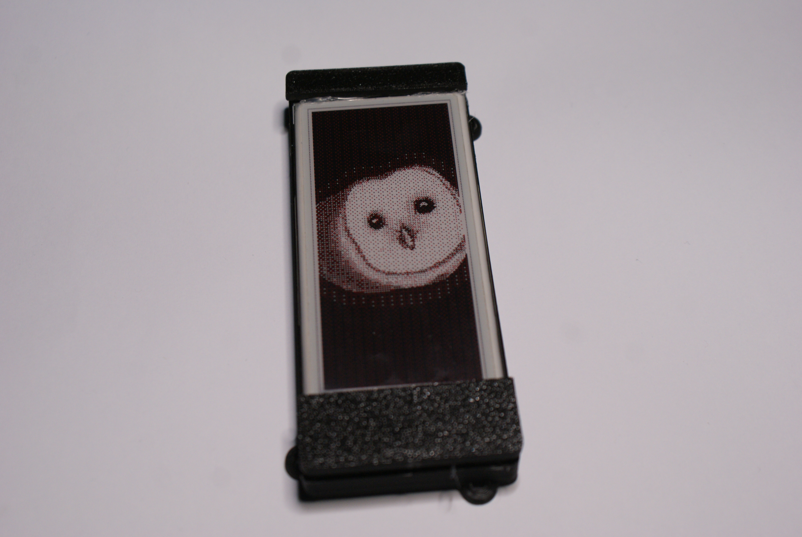
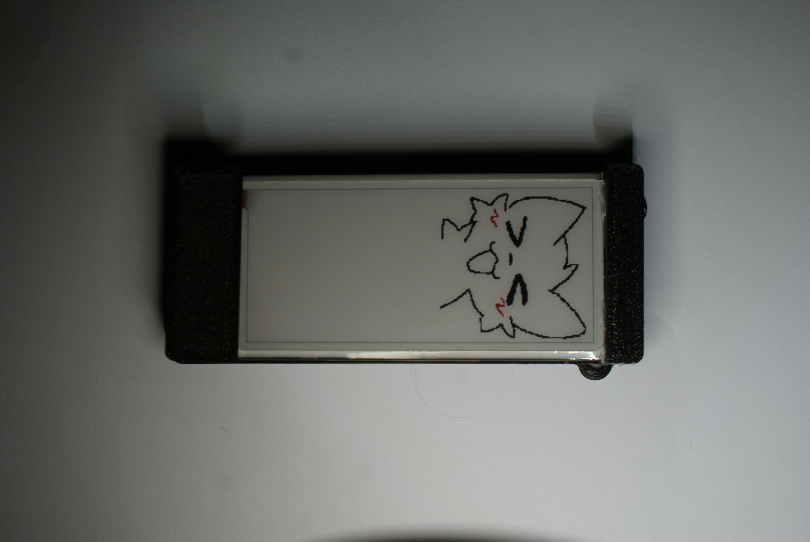
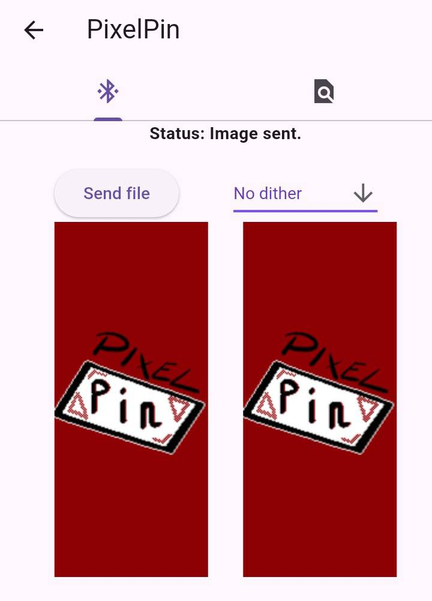
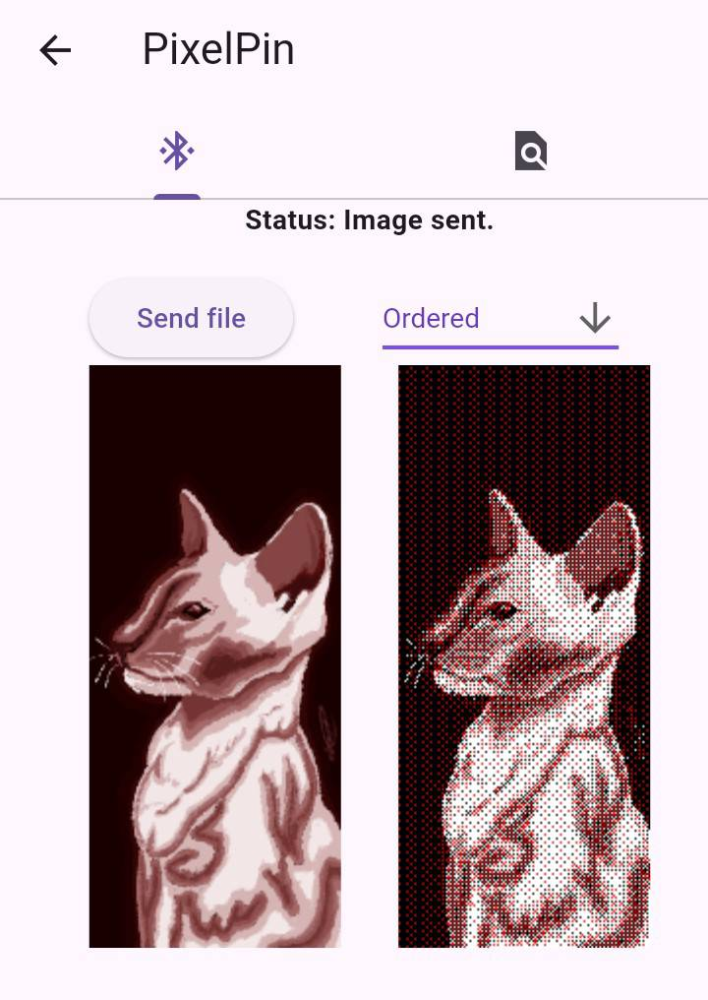

# PixelPin

PixelPin is a wearable e-paper display pin powered by an ESP32. It receives images over Bluetooth Low Energy (BLE) from a companion Flutter app using a custom binary protocol, applies Floyd-Steinberg dithering to convert full-color images to a 3-color (black, white, red) palette, and renders them to a 2.9-inch tri-color e-paper display. The device enters deep sleep after 5 minutes of inactivity and wakes on a button press, making it suitable for wearable use.

This repository contains the ESP32 firmware written in C++. The companion Flutter app lives at [pixelpin-app](https://github.com/mikolajlubiak/pixelpin-app).

## Showcase

<h3 align="center">Device</h3>
<p align="center">
  <a href="docs/epd2.jpg"></a>
  <a href="docs/epd6.jpg"></a>
</p>

<p align="center">
  <a href="docs/epd1.jpg"></a>
  <a href="docs/epd3.jpg"></a>
  <a href="docs/epd4.jpg"></a>
  <a href="docs/epd5.jpg"></a>
  <a href="docs/epd7.jpg"></a>
</p>

<h3 align="center">App</h3>
<p align="center">
  <a href="docs/app1.jpg"></a>
  <a href="docs/app2.jpg"></a>
</p>

## Features

- **BLE image transfer** using a custom binary protocol with text-based command framing and raw binary data streaming
- **Floyd-Steinberg dithering** for high-quality 3-color (black/white/red) rendering on e-paper
- **Custom state machine** for reliable chunked BLE transfers across multiple write operations
- **Dual display support**: 2.9-inch tri-color e-paper (primary) or 240×320 TFT LCD (via compile flag)
- **Power management**: deep sleep after 5 minutes of inactivity, GPIO wake-up on button press (ESP32-C3)
- **ESP32 firmware** in C++ using the Arduino framework via PlatformIO
- **Companion Flutter app** for image selection, processing, and BLE transmission

## Tech Stack

`C++` `ESP32` `BLE` `FreeRTOS` `E-Paper` `Flutter` `PlatformIO` `GxEPD2`

## How It Works

```
Phone App  ──BLE──►  ESP32  ──RGB565──►  Dithering  ──1-bit buffers──►  E-Paper Display
(Flutter)             |                  (Floyd-                          (black/white/red)
                      |                   Steinberg)
                      └── Deep sleep after 5 min inactivity
```

1. The Flutter app converts the selected image to RGB565 format and sends it over BLE using the [custom binary protocol](docs/BLE_PROTOCOL.md).
2. The ESP32 firmware receives the image in chunks, accumulating data into two 1-bit framebuffers (monochrome and color).
3. After the full image is received, the firmware runs Floyd-Steinberg dithering, mapping each pixel to one of three values: black, white, or red.
4. The two framebuffers are sent to the e-paper display driver (GxEPD2), which handles the SPI communication and display refresh cycle.

See [docs/ARCHITECTURE.md](docs/ARCHITECTURE.md) for a detailed system overview, [docs/BLE_PROTOCOL.md](docs/BLE_PROTOCOL.md) for the full protocol specification, and [docs/IMAGE_PROCESSING.md](docs/IMAGE_PROCESSING.md) for the image processing pipeline.

## Build Instructions

### Prerequisites

- [PlatformIO](https://platformio.org/) (CLI or VS Code extension)
- ESP32-C3 or ESP32-S3 development board
- 2.9-inch tri-color e-paper display (GxEPD2_290_C90c) **or** ST7789 TFT (240×320)

### Build and Flash

```bash
# Clone the repository
git clone https://github.com/mikolajlubiak/pixelpin.git
cd pixelpin

# Flash to ESP32-C3 with e-paper display (default)
pio run -e esp32-c3-devkitm-1 --target upload

# Flash to ESP32-S3 with e-paper display
pio run -e esp32-s3-devkitm-1 --target upload

# Monitor serial output
pio device monitor
```

### Display Selection

The firmware supports two display backends selected at compile time via build flags in `platformio.ini`:

| Flag    | Display               | Resolution | Colors   |
|---------|-----------------------|------------|----------|
| `-DEPD` | E-Paper (GxEPD2_290_C90c) | 128×296 | Black/White/Red |
| `-DTFT` | TFT LCD (ST7789)      | 320×240    | RGB565 (65K) |

The default build flag is `-DEPD`. To switch to TFT, change `build_flags` in `platformio.ini`.

### Wiring

**E-Paper (ESP32-C3):**

| Display Pin | ESP32-C3 Pin |
|-------------|--------------|
| CS          | SS (GPIO 7)  |
| DC          | GPIO 1       |
| RST         | GPIO 10      |
| BUSY        | GPIO 2       |

**E-Paper (ESP32-S3):**

| Display Pin | ESP32-S3 Pin |
|-------------|--------------|
| CS          | GPIO 10      |
| DC          | GPIO 3       |
| RST         | GPIO 8       |
| BUSY        | GPIO 18      |

**TFT ST7789:**

| Display Pin | ESP32 Pin |
|-------------|-----------|
| CS          | GPIO 10   |
| DC          | GPIO 8    |
| RST         | —         |

The wake-up button connects to **GPIO 3** on ESP32-C3.

## Documentation

- [Architecture Overview](docs/ARCHITECTURE.md)
- [BLE Protocol Specification](docs/BLE_PROTOCOL.md)
- [Image Processing Pipeline](docs/IMAGE_PROCESSING.md)
- [Contributing Guide](CONTRIBUTING.md)
